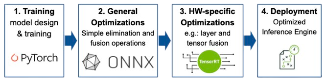
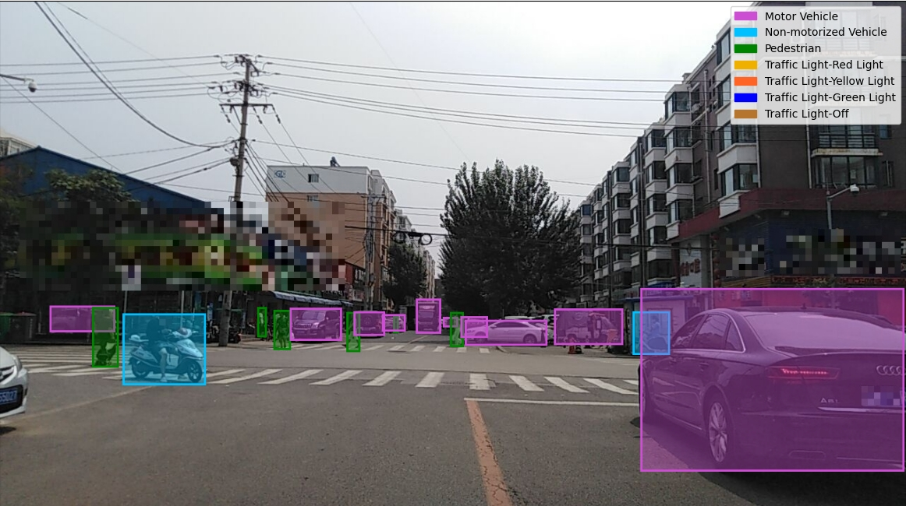
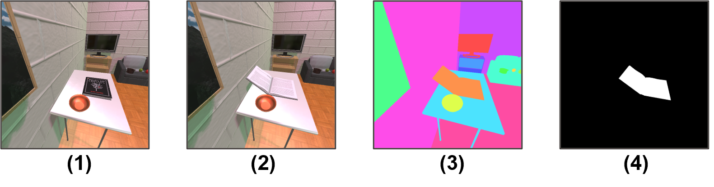
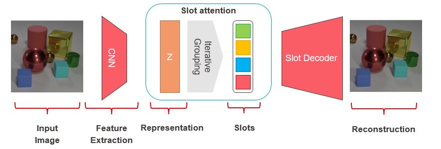

# Computer Vision

In this repository some projects in the context of Computer Vision are presented. These projects include contents of the graduate level courses of the Technical University of Munich and École polytechnique fédérale de Lausanne. 

##  Object detection and Classification on an embedded GPU or FPGA system

:key: Keywords: Object Detection

:wrench: PyTorch, Onnx, TensorRT, MMDetection

:round_pushpin: 

  
  

The DAC System Design Contest focuses on object detection and classification on an embedded GPU or FPGA system. Contestants will receive a training dataset provided by Baidu, and a hidden dataset will be used to evaluate the performance of the designs in terms of accuracy and speed.

## Learning Object-Centric Representations of Visually Complex Scenes

:key: Keywords: Representation Learning, Self-supervised Learning, Contrastive Learning, Slot Attention

:wrench: PyTorch, Slurm, Wandb

:round_pushpin: 

Learning distributed vector representations has been a driving force behind the remarkable success of deep neural networks in perceptual tasks on ImageNet-like photos with solitary objects (cars, trunks, etc.) in the center. Yet, visual scenes in the real world are often much more sophisticated and composed of multiple entities, including static objects and dynamic agents, that strongly interact with each other [[1]](#1).

One emerging paradigm for capturing the compositional nature of complex scenes is to learn slot-based object-centric representations [[2]](#2). This approach has demonstrated great promise in tackling difficult problems, such as abstract visual reasoning and out-of-distribution generalization, as well as discovering structural causal representations that permit sparse and independent interventions of each entity. Nevertheless, existing methods to date are still largely limited to simple synthetic settings with low visual complexity.

#### :bookmark_tabs: Sources
<a id="1">[1]</a> 🏘️ ProcTHOR: Large-Scale Embodied AI Using Procedural Generation. [Deitke, Matt, et al. NeurIPS 2022](https://arxiv.org/abs/2206.06994)

<a id="2">[2]</a> Object-centric learning with slot attention [Locatello, Francesco, et al. NeurIPS 2020](https://proceedings.neurips.cc/paper/2020/hash/8511df98c02ab60aea1b2356c013bc0f-Abstract.html)

## Foreground Background Detection
:key: Keywords: Gaussian Mixture Model, Unsupervised foreground segmentation

:wrench: Matlab

:round_pushpin:  

#### Segmentation
Implementation of a Gaussian Mixture Model based forground segmenation model from the papers "Efficient adaptive density estimation per image pixel for the task of background subtraction" [[3]](#3), "Improved Adaptive Gaussian Mixture Model for Background Subtraction"[[4]](#4) and Adaptive background mixture models for real-time tracking [[5]](#5). The model was developed in Matlab and evaluated on the ChokePoint Dataset [[6]](#6).

:link: https://arma.sourceforge.net/chokepoint/

Observations: Objects that move once the background model has been created tend to create a "ghost". This phenomenon can best be observed if the start of the frames is chosen in such a way that a person is already in the image at this point. The "ghost" remains in the image as foreground for the following frames. 

#### :bookmark_tabs: Sources

<a id="3">[3]</a> Efficient adaptive density estimation per image pixel for the task of background subtraction [Zivkov Z. et al., 2004](https://www.sciencedirect.com/science/article/pii/S0167865505003521)

<a id="4">[4]</a> Improved Adaptive Gaussian Mixture Model for Background Subtraction [Zivkov Z., 2006](https://ieeexplore.ieee.org/document/1333992)

<a id="5">[5]</a> Adaptive background mixture models for real-time tracking [Stauffer C., W.E.L Grimson 1999](http://www.ai.mit.edu/projects/vsam/Publications/stauffer_cvpr98_track.pdf)

<a id="6">[6]</a> Patch-based Probabilistic Image Quality Assessment for
Face Selection and Improved Video-based Face Recognition [Wong et al., 2014](https://arxiv.org/abs/1304.0869)

## Learning with limited (labeled) Data
:key: Keywords: Active Learning, Self-supervised Learning, Contrastive Learning

:wrench: Tools: TensorFlow, MLFlow, Docker, Kubernetes 